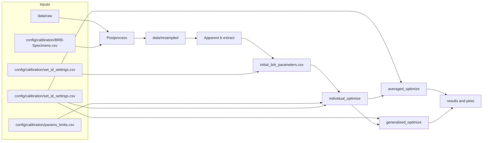
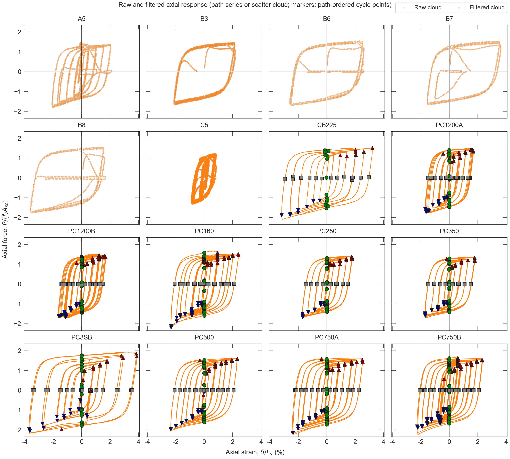
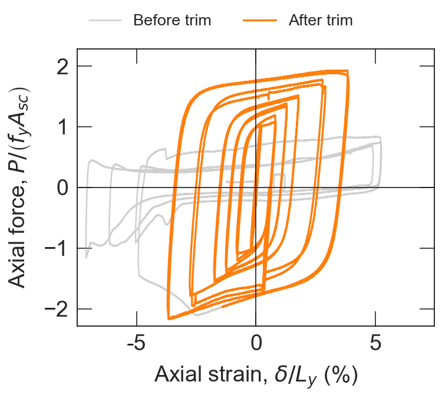
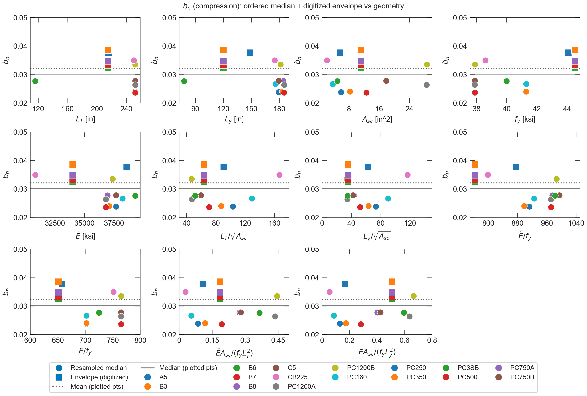
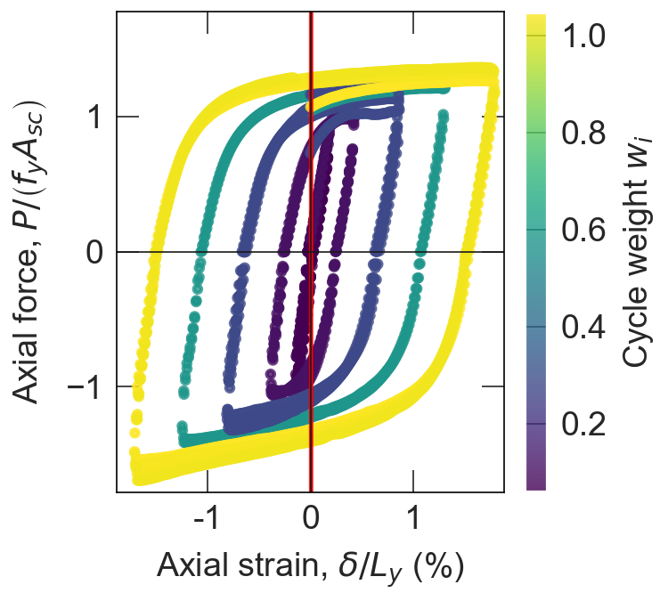
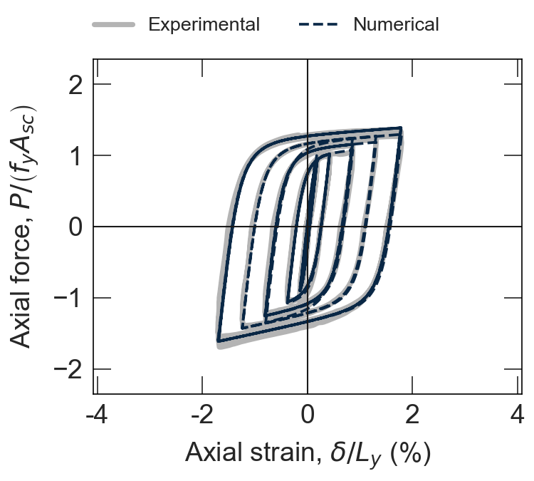
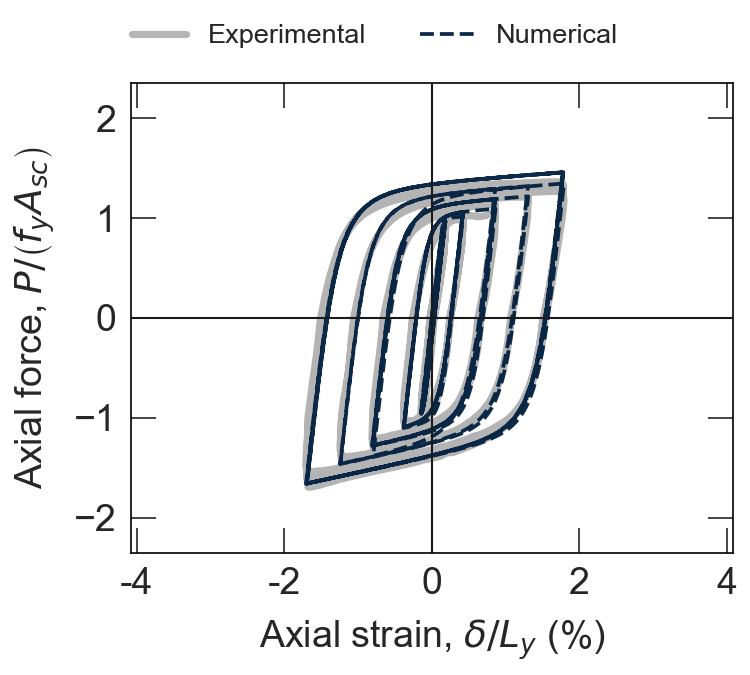
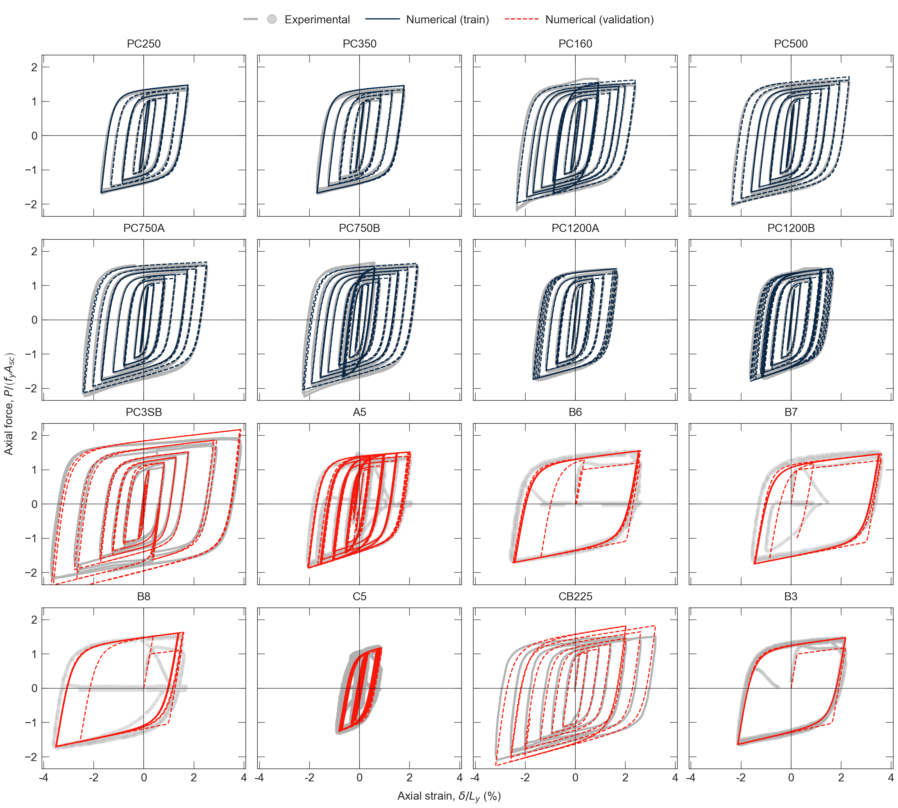

# BRB-Calibration

A Python pipeline for calibrating **OpenSees SteelMPF** parameters for buckling-restrained braces (BRBs) using experimental hysteresis data.

Each specimen is modeled with a **single corotational truss**, driven by a **fixed, resampled displacement history**; a subset of steel parameters is optimized so the simulated axial force matches the test.

After **per-specimen** L-BFGS-B fits (gated by **`individual_optimize`** in `BRB-Specimens.csv`), the pipeline can run **generalized** optimization of a shared SteelMPF vector: one L-BFGS problem per `set_id` row in `set_id_settings_generalized.csv`, each over all path-ordered specimens with positive **`generalized_weight`** (or a single pooled run with `--no-by-set-id`).

**Navigating the code:** folder roles, a data-flow diagram, and a "where to edit" table are in [`scripts/README.md`](scripts/README.md). Specimen inclusion and paths are centralized in [`scripts/postprocess/specimen_catalog.py`](scripts/postprocess/specimen_catalog.py).

---

## Table of Contents

- [Quick Start](#quick-start)
- [System Overview](#system-overview)
- [Example Figures](#example-figures)
- [Repository Layout and Configuration Files](#repository-layout-and-configuration-files)
- [Data Layer](#data-layer)
- [Numerical Model](#numerical-model)
- [Calibration Pipeline](#calibration-pipeline)
  - [Identification Objective](#identification-objective)
  - [Parameter Seeding and Initialization](#parameter-seeding-and-initialization)
  - [Individual Specimen Optimization](#individual-specimen-optimization)
  - [Generalized calibration stage](#generalized-calibration-stage)
  - [Specimen Weights](#specimen-weights)
  - [Parameter Summary Reports](#parameter-summary-reports)
- [Running the Pipeline](#running-the-pipeline)
  - [Full Run](#full-run)
  - [Averaged Evaluation](#averaged-evaluation)
  - [Run generalized optimization](#run-generalized-optimization)
  - [Other One-Off Commands](#other-one-off-commands)
  - [Step-by-Step Reference](#step-by-step-reference)
- [Key Outputs](#key-outputs)
- [Workspace Management](#workspace-management)
- [Script Index](#script-index)
- [Optimizer Settings](#optimizer-settings)
- [Glossary](#glossary)
- [Additional Resources](#additional-resources)
- [Note on Development](#note-on-development)

---

## Quick Start

```bash
git clone https://github.com/gaaraujo/BRB-Calibration.git
cd BRB-Calibration
pip install -r requirements.txt
./run.sh          # Unix
# .\run.ps1       # Windows PowerShell
```

**What this does:** runs postprocess → apparent $b$ extraction → initial parameters → per-specimen optimization → averaged evaluation → generalized optimization → combined overlay plots → parameter summary tables. Generated artifacts live under **`results/calibration/`** and **`results/plots/`** (gitignored until you run the pipeline locally).

---

## System Overview

Experimental CSVs under `data/raw/` are filtered, resampled, and converted into cycle metadata. Apparent hardening statistics and [`set_id_settings.csv`](config/calibration/set_id_settings.csv) define multiple `set_id` seeds. L-BFGS-B fits SteelMPF parameters per specimen, and **averaged** and **generalized** stages summarize behavior across the specimen set. Results are reported through metrics tables and overlay plots. Objective weights (`w_feat_l2`, `w_feat_l1`, `w_energy_l2`, `w_energy_l1`, `w_unordered_binenv_l2`, `w_unordered_binenv_l1`) and amplitude cycle weights are defined **per `set_id`** in [`set_id_settings.csv`](config/calibration/set_id_settings.csv) (and can be globally overridden for cycle weights via `--amplitude-weights` / `--no-amplitude-weights`).



The framework supports both **path-ordered** lab records and **digitized unordered** literature data (`experimental_layout`, `path_ordered` in the catalog). Calibration is sensitive to initial SteelMPF values, so the repo defines **several parallel seed rows** in [`set_id_settings.csv`](config/calibration/set_id_settings.csv) (one per `set_id`). After optimization, compare losses across `set_id` and treat the best seed for the specimen set as the recommended backbone. Aggregate loss and tables are summarized in [`scripts/calibrate/report_averaged_vs_generalized_metrics.py`](scripts/calibrate/report_averaged_vs_generalized_metrics.py).

---

## Example Figures

The images below are frozen snapshots (see [`docs/readme/README.txt`](docs/readme/README.txt)). After a local run, full-resolution plots appear under **`results/plots/`** with the same naming patterns.

<p align="center">

</p>
<p align="center"><em>Figure 1. Raw and filtered experimental data for each specimen (<code>plot_specimens.py</code> → <code>results/plots/postprocess/force_deformation/raw_and_filtered/</code>).</em></p>

<p align="center">

</p>
<p align="center"><em>Figure 2. Experimental data before and after trimming cycles after fracture (behavior we do not model) (<code>results/plots/postprocess/force_deformation/trim_comparison/</code>).</em></p>

<p align="center">

</p>
<p align="center"><em>Figure 3. Apparent $b_n$ kinematic hardening vs BRB geometry (<code>plot_b_histograms_and_scatter.py</code> → <code>results/plots/apparent_b/b_vs_geometry/</code>).</em></p>

<p align="center">

</p>
<p align="center"><em>Figure 4. Cycles colored by assigned weight in individual optimization when amplitude weights are enabled in <code>config/calibration/set_id_settings.csv</code> (or <code>--amplitude-weights</code>) (<code>optimize_brb_mse.py</code> → <code>results/plots/calibration/individual_optimize/cycle_weights/</code>).</em></p>

<p align="center">

</p>
<p align="center"><em>Figure 5. Experimental vs numerical force–deformation from individual optimization (<code>plot_params_vs_filtered.py</code> → <code>results/plots/calibration/individual_optimize/overlays/</code>).</em></p>

<p align="center">

</p>
<p align="center"><em>Figure 6. Experimental vs numerical force–deformation using averaged parameter values from the individual optimizations (<code>eval_averaged_params.py</code> → <code>results/plots/calibration/averaged_optimize/overlays/</code>).</em></p>

<p align="center">

</p>
<p align="center"><em>Figure 7. Experimental vs numerical force–deformation from generalized optimization (<code>optimize_generalized_brb_mse.py</code> → <code>results/plots/calibration/generalized_optimize/overlays/</code>).</em></p>

<p align="center">

</p>
<p align="center"><em>Figure 8. Combined montage for one set of parameters (<code>plot_compare_calibration_overlays.py</code> → <code>set*_combined_force_def_norm.png</code> under each method's <code>overlays/</code>).</em></p>

---

## Repository Layout and Configuration Files

```
BRB-Calibration/
├── data/
│   ├── raw/{Name}/              # Input experimental CSVs
│   ├── filtered/{Name}/         # Segment-filtered series
│   ├── resampled/{Name}/        # Resampled paths / unordered copies
│   ├── cycle_points_original/   # Cycle JSON (filtered index space)
│   └── cycle_points_resampled/  # Cycle JSON (resampled index space)
├── scripts/
│   ├── postprocess/             # Catalog, filtering, resampling, QA plots
│   ├── calibrate/               # Optimization, averaged/generalized, reports
│   └── model/                   # OpenSees corotruss + geometry
├── results/                     # Generated calibration + plots (gitignored)
├── config/
│   ├── calibration/             # Calibration inputs (not raw experimental CSVs)
│   │   ├── BRB-Specimens.csv
│   │   ├── params_limits.csv
│   │   └── set_id_settings.csv            # per-set_id: steel seeds + optimize_params + objective weights + amplitude cycle weights
│   └── raw_trim_ranges.yaml     # Optional raw row trims
├── summary_statistics/          # Parameter summary MD/CSVs + generalized set_id eval rollup (generated)
├── docs/
│   └── readme/                  # Committed README figure snapshots
├── run.sh / run.ps1
├── clean_outputs.sh / clean_outputs.ps1
└── archive_pipeline_outputs.sh / archive_pipeline_outputs.ps1
```

| File | Role |
|------|------|
| `config/calibration/BRB-Specimens.csv` | Geometry, layout flags, `individual_optimize`, `generalized_weight`, … |
| `config/calibration/params_limits.csv` | Optional finite bounds per parameter (`parameter`, `lower`, `upper`); omitted parameters are unbounded |
| `config/calibration/set_id_settings.csv` | One row per `set_id`: steel seeds (`E,R0,cR1,cR2,a1–a4,b_p,b_n`), `optimize_params`, and objective/amplitude settings (`w_*`, `use_amplitude_weights`, `amplitude_weight_*`). Leave blank to use defaults. |

---

## Data Layer

### Specimen Catalog and Raw Data

The catalog **`BRB-Specimens.csv`** supplies geometry (`L_T_in`, `L_y_in`, `A_c_in2`, …), nominal yield, and layout flags. **`experimental_layout`** is **`raw`** or **`digitized`** (legacy spellings are normalized on read).

| Column | Values | Meaning |
|--------|--------|---------|
| `experimental_layout` | `raw` | Lab / raw specimen set; primary F–u: `data/raw/{Name}/force_deformation.csv` |
| | `digitized` | Digitized specimen set; simulated in averaged/generalized stages when parameter rows exist |
| `path_ordered` | `true` / `false` | With **`digitized`**: `true` = path-ordered `force_deformation.csv`; `false` = unordered F–u samples plus `deformation_history.csv` |
| `skip_filter_resample` | `true` / `false` | If `true`, filtered path omits Savitzky–Golay; **resampling still runs** |
| `individual_optimize` | `true` / `false` | Eligibility for `optimize_brb_mse` when resampled `force_deformation.csv` exists |
| `generalized_weight` | ≥ 0 | Weight in generalized objective (path-ordered only; unordered rows excluded) |

**Two kinds of experimental data.** Most specimens have a **path-ordered** force–deformation record: points follow a single continuous hysteresis trajectory (lab instrumentation or digitization that preserves order), so cycle landmarks, filtering, and resampling apply in the usual way. A subset comes from **digitized literature** plots where **force and deformation were sampled as unordered $(F,u)$ points**—the pairs are **not** in loading-path order. For those, the model still has a meaningful **deformation history** (prescribed axial motion applied during the test), supplied as `deformation_history.csv`. The pipeline drives the simulation with that history (after any resampling), so you get a **continuous simulated force** to compare **visually** against the **scattered** experimental points (overlay plots), even though there is no single ordered $F$–$u$ path to match point-for-point like a path-ordered hysteresis. This distinction is important because only **path-ordered** data supports cycle-based feature extraction.

**Inputs per specimen (`data/raw/{Name}/`):** `force_deformation.csv` (path or unordered samples); `deformation_history.csv` for digitized unordered rows; optional QA PNGs; optional row trimming via `config/raw_trim_ranges.yaml`. **Digitized unordered:** postprocess writes a resampled drive under `data/resampled/{Name}/deformation_history.csv`; averaged/generalized evaluation uses envelope $b_p$, $b_n$ from the unordered F–u file where applicable.

### Signal Processing Pipeline

For **path-ordered** specimens: `cycle_points.py` → `filter_force.py` → `resample_filtered.py` produce filtered/resampled CSVs and cycle JSON; `plot_specimens.py` writes QA plots under `results/plots/postprocess/`. **Unordered** digitized rows follow the catalog-specific branch (unordered copy, drive resampling). All calibration and apparent-$b$ work reads **resampled** series.

---

## Numerical Model

This section describes how each BRB specimen is represented in OpenSees.

### Corotational Truss and SteelMPF

The BRB is modeled as a **two-node corotational truss** (`corotTruss` in OpenSees) of total length $L_T$ with cross-sectional area $A_{\mathrm{sc}}$ (steel core). The fiber uses uniaxial material **SteelMPF**—the Menegotto–Pinto steel model extended by Filippou et al. (1983), with separate tension/compression yield and hardening ([OpenSeesPy `SteelMPF`](https://openseespydoc.readthedocs.io/en/latest/src/SteelMPF.html), [OpenSees wiki](https://opensees.berkeley.edu/wiki/index.php/SteelMPF_-_Menegotto_and_Pinto_(1973)_Model_Extended_by_Filippou_et_al._(1983))). [`scripts/model/corotruss.py`](scripts/model/corotruss.py) assigns prescribed axial displacements at the free node; there is no extra kinematic degree of freedom in the optimizer.

### Brace geometry symbols

These quantities come from the specimen catalog (`BRB-Specimens.csv`); units follow the project (lengths in inches, areas in in², stress in ksi unless noted).

| Symbol | Meaning |
|--------|---------|
| $L_T$ | Total brace length used in the truss (work-point to work-point). |
| $L_y$ | Length of the **yielding (core)** region along the brace axis. |
| $A_{\mathrm{sc}}$ | Cross-sectional area of the **steel core** (yielding segment); used as the truss area in OpenSees. |
| $A_t$ | Representative area of the **non-yielding transition** steel (stiffer end regions); used only in the stiffness factor $Q$, not as a separate element. |

### Brace Geometry and Stiffness Factor $Q$

Physically, the brace combines a **yielding core** (length $L_y$, area $A_{\mathrm{sc}}$) with **non-yielding transition** regions (stiffer steel, area $A_t$) at each end. Their **axial stiffness acts in series** with the core. Rather than meshing multiple elements, the implementation uses **one** truss with SteelMPF based on core properties $(f_{yp}, f_{yn}, E, b_p, b_n, \ldots)$ but replaces the elastic modulus by

$$\hat{E} = Q\,E$$

so that the end stiffness of the single bar matches the **series** axial response of core plus transitions. **`compute_Q()`** in [`scripts/model/brace_geometry.py`](scripts/model/brace_geometry.py) implements

$$Q = \frac{1}{\displaystyle\frac{2(L_T - L_y)/L_T}{A_t/A_{\mathrm{sc}}} + \frac{L_y}{L_T}} = \frac{L_T}{\,2(L_T - L_y)\,\dfrac{A_{\mathrm{sc}}}{A_t} + L_y\,}\,.$$

Require $L_T, A_{\mathrm{sc}}, A_t > 0$ and $0 \leq L_y \leq L_T$; if $L_y = L_T$ the transition term vanishes and $Q = 1$.

### SteelMPF parameters

SteelMPF takes tensile/compressive yield $(f_{yp}, f_{yn})$, initial modulus $E_0$, strain-hardening ratios $(b_p, b_n)$ in tension and compression, curvature parameters $(R_0, c_{R1}, c_{R2})$, and optional isotropic-hardening pairs $(a_1, a_2)$ and $(a_3, a_4)$ ([OpenSeesPy API](https://openseespydoc.readthedocs.io/en/latest/src/SteelMPF.html)).

**Elastic and yield.** Nominal yield strengths $f_{yp}$ and $f_{yn}$ are usually taken from **coupon or component tests** (or catalog nominal values). **Young’s modulus** is fixed at **$E = 29{,}000\ \mathrm{ksi}$** (≈ **200 GPa**, ≈ $2.0\times 10^5\ \mathrm{MPa}$) in [`set_id_settings.csv`](config/calibration/set_id_settings.csv) and passed to `run_simulation()` as $E_0$.

**Kinematic hardening ($b_p$, $b_n$).** In SteelMPF, $b_p$ and $b_n$ are the ratios of the **post-yield tangent** to $E$ in tension and compression (Menegotto–Pinto asymptotic slopes). In this workflow they are **not** free optimization variables for default runs: they are seeded from **apparent hardening** statistics per cycle (e.g. median / quartiles of segment slopes from the resampled experiment via `extract_bn_bp.py` and `build_initial_brb_parameters.py`), i.e. slopes inferred from the test record rather than held fixed at a single handbook value.

**Curvature / Bauschinger ($R_0$, $c_{R1}$, $c_{R2}$).** The transition between elastic and plastic asymptotes is curved; the **cyclic curvature parameter** $R$ controls that shape and evolves with strain history (Bauschinger effect). In the Filippou–type update used in OpenSees steel materials, $R$ depends on $R_0$, $c_{R1}$, $c_{R2}$, and the **absolute strain difference** $\varepsilon_r$ between the current asymptote intersection and the previous strain reversal (same structure as Steel02). A standard form is

$$R = R_0\left(1 - c_{R1}\,\frac{\varepsilon_r}{c_{R2} + \varepsilon_r}\right)$$

(with $\varepsilon_r$ in strain units; see OpenSees documentation). **SteelMPF** extends the Menegotto–Pinto law with separate tension/compression asymmetry and improved behavior under partial unloading ([wiki discussion](https://opensees.berkeley.edu/wiki/index.php/SteelMPF_-_Menegotto_and_Pinto_(1973)_Model_Extended_by_Filippou_et_al._(1983))).

**Isotropic hardening ($a_1$–$a_4$).** Optional parameters shift the yield envelopes after plastic excursions: $a_1$, $a_2$ govern **compression** isotropic expansion after tensile plastic straining; $a_3$, $a_4$ govern **tension** after compressive plastic straining (see the OpenSeesPy table: thresholds scale with $f_{yp}/E$ and $f_{yn}/E$). For simplicity **$a_2 = a_4 = 1$** (defaults in [`corotruss.py`](scripts/model/corotruss.py)) so that **$a_1$** and **$a_3$** primarily set the **degree** of isotropic hardening in compression and tension.

### Parameters chosen for optimization

With $f_{yp}$, $f_{yn}$, $E$, and apparent-$b$ seeds for $b_p$, $b_n$ fixed from data and seeds, the **remaining** SteelMPF degrees of freedom targeted by L-BFGS-B are the **Bauschinger / curvature** set $(R_0, c_{R1}, c_{R2})$ and the **isotropic** pair $(a_1, a_3)$ (with $a_2 = a_4 = 1$). The default active list is **`PARAMS_TO_OPTIMIZE`** in [`scripts/calibrate/params_to_optimize.py`](scripts/calibrate/params_to_optimize.py). Optional per-`set_id` overrides live in [`set_id_settings.csv`](config/calibration/set_id_settings.csv) (same allowlist; include $b_p$, $b_n$ there to optimize them using the numeric values already in `initial_brb_parameters.csv`).

---

## Calibration Pipeline

### Identification Objective

The optimizer minimizes $J_{\mathrm{total}}$, the weighted sum of raw **J_feat** (L2/L1), **J_E** (L2/L1), and **J_binenv** (L2/L1) from per-`set_id` settings in [`set_id_settings.csv`](config/calibration/set_id_settings.csv), subject to the model following the fixed resampled displacement sequence $\{u_i\}$.

**Simulation.** `scripts/model/corotruss.py` (`run_simulation`): two-node corotational truss, SteelMPF, $\hat{E} = Q E$.

**Scales.** Global deformation and force ranges for normalization:

$$S_D = \max_i u_i - \min_i u_i,\qquad S_F = \max_i F^{\mathrm{exp}}_i - \min_i F^{\mathrm{exp}}_i$$

(with fallbacks to 1 if degenerate). Nominal yield force $P_y$ [kip] for reporting (`P_y_ref`) comes from the catalog. For energy, the same experiment-wide scale

$$S_E = S_F\, S_D$$

is used (see `energy_scale_s_e` in [`amplitude_mse_partition.py`](scripts/calibrate/amplitude_mse_partition.py)). Metrics CSVs store raw **J_feat**, **J_E**, and **J_binenv** (each L2/L1) plus **`J_total`**. **`initial_unordered_J_binenv`** / **`final_unordered_J_binenv`** and the L1 companions (see [`digitized_unordered_eval_lib.py`](scripts/calibrate/digitized_unordered_eval_lib.py)) implement **$J_{\mathrm{binenv}}$**: deformation bins; in each bin $F^{\mathrm{up}}=\max F$ and $F^{\mathrm{lo}}=\min F$ separately for experiment and simulation; the bin L2 error is $\tfrac12\bigl[((F^{\mathrm{up}}_{\mathrm{exp}}-F^{\mathrm{up}}_{\mathrm{num}})/S_F)^2+((F^{\mathrm{lo}}_{\mathrm{exp}}-F^{\mathrm{lo}}_{\mathrm{num}})/S_F)^2\bigr]$; **$J_{\mathrm{binenv}}$** is the mean over bins where both clouds have at least one point. **$J_{\mathrm{binenv,L1}}$** uses the same bins with an L1 upper/lower gap per bin. Proximity figures may still show one-sided nearest-neighbor links for visualization only; those distances are **not** written as metrics. Normalization uses $S_D=\max u-\min u$ and $S_F=\max F^{\mathrm{exp}}-\min F^{\mathrm{exp}}$ on the experimental series (or cloud for digitized unordered). Only terms with nonzero weights in the loss CSV contribute to **$J_{\mathrm{total}}$**.

**Weight cycles.** The resampled record is split into **weight cycles** using sorted **zero-deformation** indices in the cycle JSON (`zero_def`): each cycle is an index span used for both losses. If there are no `zero_def` points, the whole record is one cycle. Amplitude $A_c$ per cycle drives **cycle weights** $w_c = (A_c/A_{\max})^p + \varepsilon$ when `use_amplitude_weights` is true in [`set_id_settings.csv`](config/calibration/set_id_settings.csv) (overridable with `--amplitude-weights` / `--no-amplitude-weights` on the optimize/eval CLIs); otherwise $w_c = 1$.

**Landmark loss $J_{\mathrm{feat}}$.** For each weight cycle $c$, the code builds up to **twelve** experimental landmarks on $(u,F^{\mathrm{exp}})$: first tension/compression yield using $F^{\mathrm{exp}} > f_y A_{\mathrm{sc}}$ and $F^{\mathrm{exp}} < -f_y A_{\mathrm{sc}}$ (no 1.1 factor), global max/min force, $F$ at $u=0$ on each yield-to-peak subpath (interpolated), two mid-$u$ points per side between yield, $u=0$, and peak, then $u$ at $F=0$ unloading after each peak (see [`cycle_feature_loss.py`](scripts/calibrate/cycle_feature_loss.py)). For **slots 1–10**, the simulation is compared at the **same experimental $u$** using squared normalized **force** error $(F^{\mathrm{sim}}-F^{\mathrm{exp}})^2/S_F^{\,2}$. For **slots 11–12**, squared normalized **displacement** error $(u^{\mathrm{sim}}-u^{\mathrm{exp}})^2/S_D^{\,2}$ at those unloadings. Averaging omits slots where either side is missing.

Average within the cycle over matched slots, then combine cycles with **amplitude weights**:

$$J_{\mathrm{feat}} = \frac{\sum_c w_c \cdot (\text{mean error in cycle }c)}{\sum_c w_c}\,.$$

So $J_{\mathrm{feat}}$ is **not** a sum over every resampled point: it compares a **small, comparable set of landmarks per cycle**, which keeps the feature loss from being driven only by whichever half-cycles happen to contain vastly more samples after resampling.

**Energy loss $J_E$.** For each weight cycle $c$, let

$$E_c^{\mathrm{exp}} = \left|\int_{u_s}^{u_e} F^{\mathrm{exp}}(u)\,\mathrm{d}u\right|,\qquad E_c^{\mathrm{sim}} = \left|\int_{u_s}^{u_e} F^{\mathrm{sim}}(u)\,\mathrm{d}u\right|$$

with the same integration limits $(u_s,u_e)$ as the cycle’s index span on the **resampled** path, using the **trapezoidal** rule (`energy_mse_cycles` in [`amplitude_mse_partition.py`](scripts/calibrate/amplitude_mse_partition.py)). Then

$$J_E = \frac{1}{S_E^{\,2}} \cdot \frac{1}{N_{\mathrm{cyc}}}\sum_c \left(E_c^{\mathrm{sim}} - E_c^{\mathrm{exp}}\right)^2$$

where $N_{\mathrm{cyc}}$ is the number of weight cycles. **Amplitude weights $w_c$ are not applied to $J_E$**—every cycle counts **once**, regardless of how many resampled points lie in that cycle.

**Role of $J_E$.** The primary motivation is to **match dissipated energy** cycle by cycle: hysteretic energy loss strongly affects **transient** response (damping-equivalent behavior, cumulative plastic work), so calibrating only on force–deformation landmarks can under-constrain energy unless a dedicated term is added. **Implementation detail:** $J_E$ uses **one scalar per weight cycle** (the trapezoidal $|\int F\,\mathrm{d}u|$), averaged **uniformly over cycles** without $w_c$, so the energy term is **not** inflated by whichever half-cycles happen to contain more resampled points—avoiding a sampling-density artifact that a naive pointwise sum would create. (Across specimens, averaged and generalized stages use separate **specimen** weights in `specimen_weights.py`; within one specimen, $J_E$ is uniform over cycles.)

**Combined objective.** $J_{\mathrm{total}} = \sum_k w_k \, m_k$ for raw metrics $m_k \in \{\texttt{J\_feat}^{L2/L1}, \texttt{J\_E}^{L2/L1}, \texttt{J\_binenv}^{L2/L1}\}$ and matching weights $w_k` per `set_id` in [`set_id_settings.csv`](config/calibration/set_id_settings.csv). Raw **J_E** is still computed for reporting when simulation succeeds even if its weights are zero.

**Optimizer.** L-BFGS-B (`scipy.optimize.minimize`); failed simulations receive a large penalty (`FAILURE_PENALTY`). Weights are read from the loss CSV (or defaults in `calibration_loss_settings.py`).

**Code map.**

| Function | Location |
|----------|----------|
| Cycle partition and $w_c$ | `build_cycle_weight_ranges` / `build_amplitude_weights` — `amplitude_mse_partition.py` |
| $J_{\mathrm{feat}}$ | `feature_mse_cycles` — `cycle_feature_loss.py` |
| $J_E$ | `energy_mse_cycles` — `amplitude_mse_partition.py` |
| $J_{\mathrm{binenv}}$ | `compute_unordered_binenv_metrics` — `digitized_unordered_eval_lib.py` |

### Parameter Seeding and Initialization

1. **`extract_bn_bp.py`** writes `results/calibration/specimen_apparent_bn_bp.csv` (segment statistics for path-ordered rows; unordered envelope means where applicable).
2. **`build_initial_brb_parameters.py`** merges the catalog, apparent-$b$ stats, and **`set_id_settings.csv`** → `results/calibration/individual_optimize/initial_brb_parameters.csv`.
3. **`params_limits.csv`** defines optional box limits; [`lbfgsb_reparam.py`](scripts/calibrate/lbfgsb_reparam.py) maps bounded parameters to $z \in [0,1]$.

Each row of **`set_id_settings.csv`** defines one **`set_id`**. Running the full pipeline repeats individual (and downstream) evaluation for every `set_id` in that file. Because L-BFGS-B is sensitive to initial parameters, we explore several seeds and recommend the `set_id` with the best specimen-set loss after optimization (see [`report_averaged_vs_generalized_metrics.py`](scripts/calibrate/report_averaged_vs_generalized_metrics.py) for weighted `final_J_total` and best-overall `set_id` summaries).

### Individual Specimen Optimization

[`optimize_brb_mse.py`](scripts/calibrate/optimize_brb_mse.py) minimizes $J$ over **`PARAMS_TO_OPTIMIZE`**. Outputs: `optimized_brb_parameters.csv`, metrics CSV, NPZ + `*_simulated.csv`, and plots under `results/plots/calibration/individual_optimize/`.

### Generalized calibration stage

**Generalized:** [`optimize_generalized_brb_mse.py`](scripts/calibrate/optimize_generalized_brb_mse.py) minimizes the weighted average of $J$ across specimens with **`generalized_weight`**, with seeds and loss weights from each numeric `set_id` row in `set_id_settings_generalized.csv` (every such row runs one optimization over the same training pool unless `--no-by-set-id` pools them).

**Unordered digitized:** training vs. evaluation behavior follows the catalog and script docstrings; see [`digitized_unordered_eval_lib.py`](scripts/calibrate/digitized_unordered_eval_lib.py).

### Specimen Weights

**`generalized_weight`** controls contribution to the generalized objective for **path-ordered** specimens only. **`individual_optimize`** selects who runs `optimize_brb_mse`. Metrics CSVs include an `individual_optimize` column.

**CB225** / **PC3SB:** set `individual_optimize=true` with `generalized_weight=0` to fit them per specimen but exclude them from the generalized aggregate.

**CB225** also sets `skip_filter_resample=true` so the filtered output matches the trim-valid raw series without Savitzky–Golay smoothing; it still receives resampled CSVs and downstream calibration like other path-ordered specimens.

### Parameter Summary Reports

[`report_calibration_param_tables.py`](scripts/calibrate/report_calibration_param_tables.py) writes Markdown + CSV summaries under **`summary_statistics/`** (e.g. `--write summary_statistics/calibration_parameter_summary.md`). When **both** `steelmpf` and `steel4` appear among the selected `set_id` rows in `set_id_settings.csv` and each has individual + generalized rows, it writes **`calibration_parameter_summary_<steel_model>.md`** plus matching **`_<steel_model>_generalized.csv`** / **`_<steel_model>_individual.csv`** (and by-`set_id` siblings), and a short **`calibration_parameter_summary.md`** index linking them—Steel4 adds `STEEL4_ISO_KEYS` columns so rollups stay within-model. With a single material model, filenames stay unsuffixed as before. The Markdown **generalized** section states the **best `set_id`** (lowest specimen-weighted mean `final_J_total` over contributing rows) and extends the per-`set_id` table with weighted-mean eval columns from `generalized_params_eval_metrics.csv` (`J_feat`, `J_feat_L1`, `J_E`, `J_E_L1`, `J_total`, `J_binenv`, `J_binenv_L1`). The companion files are:

- **`summary_statistics/calibration_parameter_summary_generalized.csv`** (or **`..._<steel_model>_generalized.csv`**) — includes `optimum_value` for shared optimized parameters (values at the best `set_id` for the specimen set from `generalized_params_eval_metrics.csv`); **`b_p` / `b_n`** are left blank there when they are not a single merged value per `set_id` with the default `PARAMS_TO_OPTIMIZE`. Parameter columns follow **`params_in_summary_tables_for_steel_model`** in `scripts/calibrate/params_to_optimize.py` (SteelMPF vs Steel4 column sets).
- **`summary_statistics/calibration_parameter_summary_individual.csv`** (or **`..._<steel_model>_individual.csv`**) — adds `mean_optima` and `mean_optima_weighted` (inverse-loss–weighted mean using `1/(final_J_feat_raw+eps)` at each specimen's best set; `--weighted-optima-eps`). Same parameter columns as the matching generalized summary CSV for that `steel_model`.
- **`summary_statistics/generalized_set_id_eval_summary.csv`** — written by [`optimize_generalized_brb_mse.py`](scripts/calibrate/optimize_generalized_brb_mse.py) (or [`report_generalized_set_id_eval_summary.py`](scripts/calibrate/report_generalized_set_id_eval_summary.py)): per-`set_id` weighted means for `J_total` / `J_feat` / `J_E`, plus largest/smallest specimen and **means with that specimen removed** (with/without outlier-style rollups).
- **`summary_statistics/generalized_unordered_J_binenv_summary_train.csv`** / **`..._validation.csv`** — rollups for **`J_binenv`** and **`J_binenv_L1`** from `final_unordered_J_binenv` / `final_unordered_J_binenv_l1`. **Train** = specimens that contribute with positive weight to generalized optimization; **validation** = all other rows in the generalized metrics file for that `set_id` (uniform weights).

Optional narrative comparison: [`report_averaged_vs_generalized_metrics.py`](scripts/calibrate/report_averaged_vs_generalized_metrics.py).

---

## Running the Pipeline

### Full Run

From the repository root:

```bash
./run.sh          # Unix
.\run.ps1         # Windows PowerShell
```

`run.sh` / `run.ps1` execute in order: postprocess → `extract_bn_bp.py` → `build_initial_brb_parameters.py` → apparent-$b$ figures → `plot_preset_overlays.py` (reads **`initial_brb_parameters.csv`**; **two** montage sets by default: `overlays_initial_params/` + `initial_params_simulated_force/` for the `individual_optimize` training cohort, and `overlays_initial_params_all_specimens/` + `initial_params_simulated_force_all_specimens/` for all path-ordered + digitized-unordered rows) → `optimize_brb_mse.py` → `plot_params_vs_filtered.py` (per-specimen optimized overlays) → averaged eval → generalized optimization + eval → `plot_compare_calibration_overlays.py` → `report_calibration_param_tables.py` → optional debug plots.

**Logging.** Mirror console output to a file (each run overwrites). Both scripts print a **finished** banner at the end with wall-clock **end time** and **elapsed** duration (same block is appended to `pipeline_log.txt` when `PIPELINE_LOG` is set, including after a failed step).

```bash
PIPELINE_LOG=pipeline_log.txt ./run.sh          # Unix
$env:PIPELINE_LOG = "pipeline_log.txt"; .\run.ps1  # PowerShell
```

Using only `./run.sh > pipeline_log.txt 2>&1` redirects all output to the file with no live terminal progress. On Windows, if you see `Stream was not readable` / `Add-Content` errors, ensure the log file is not open in an editor.

### Averaged Evaluation

```bash
python scripts/calibrate/eval_averaged_params.py \
  --params results/calibration/individual_optimize/optimized_brb_parameters.csv \
  --output-params results/calibration/averaged_optimize/averaged_brb_parameters.csv \
  --output-metrics results/calibration/averaged_optimize/averaged_params_eval_metrics.csv \
  --output-plots-dir results/plots/calibration/averaged_optimize/overlays
```

Options: `--no-by-set-id`, `--specimen <Name>`. Edit weights in `scripts/calibrate/specimen_weights.py` only.

### Run generalized optimization

```bash
python scripts/calibrate/optimize_generalized_brb_mse.py \
  --output-params results/calibration/generalized_optimize/generalized_brb_parameters.csv \
  --output-metrics results/calibration/generalized_optimize/generalized_params_eval_metrics.csv \
  --output-plots-dir results/plots/calibration/generalized_optimize/overlays
```

Options: `--no-by-set-id`, `--specimen <Name>`.

### Other One-Off Commands

```bash
# Single specimen
python scripts/calibrate/optimize_brb_mse.py \
  --specimen <Name> --initial-params <path> --output <path>

# Preset combined overlays from initial_brb_parameters.csv (pipeline step 9)
python scripts/calibrate/plot_preset_overlays.py

# Overlay plots (optimized or any parameters CSV)
python scripts/calibrate/plot_params_vs_filtered.py \
  --params results/calibration/individual_optimize/optimized_brb_parameters.csv \
  --output-dir overlays

# Combined montage
python scripts/calibrate/plot_compare_calibration_overlays.py
# Optional: --overlays-dir <path> to process a single overlays folder

# Change optimized parameters
# Edit PARAMS_TO_OPTIMIZE in scripts/calibrate/params_to_optimize.py (source of truth)

# Regenerate parameter tables
python scripts/calibrate/report_calibration_param_tables.py \
  --write summary_statistics/calibration_parameter_summary.md
```

### Step-by-Step Reference

Run from the repo root in order if you prefer not to use `run.sh` / `run.ps1`:

| Step | Command | Main Outputs |
|------|---------|--------------|
| 1 | `python scripts/postprocess/cycle_points.py --overwrite` | `data/cycle_points_original/*.json` |
| 2 | `python scripts/postprocess/filter_force.py` | `data/filtered/{Name}/` |
| 3 | `python scripts/postprocess/resample_filtered.py` | `data/resampled/{Name}/`, `data/cycle_points_resampled/*.json` |
| 4 | `python scripts/postprocess/plot_specimens.py` | `results/plots/postprocess/` |
| 5 | `python scripts/calibrate/extract_bn_bp.py` | `specimen_apparent_bn_bp.csv` |
| 6 | `python scripts/calibrate/build_initial_brb_parameters.py` | `initial_brb_parameters.csv` |
| 7–8 | `plot_b_slopes.py`, `plot_b_histograms_and_scatter.py` | `results/plots/apparent_b/` |
| 9 | `plot_preset_overlays.py` (default params: `initial_brb_parameters.csv`; `--scope` `train`, `all`, or `both`) | `overlays_initial_params/`, `initial_params_simulated_force/` (train); `overlays_initial_params_all_specimens/`, `initial_params_simulated_force_all_specimens/` (all specimens) |
| 10 | `python scripts/calibrate/optimize_brb_mse.py` | `calibration/individual_optimize/*`, cycle-weight plots |
| 11 | `python scripts/calibrate/plot_params_vs_filtered.py` (optimized params) | `plots/calibration/individual_optimize/overlays/` |
| 12 | `python scripts/calibrate/eval_averaged_params.py` (see above) | `calibration/averaged_optimize/*` |
| 13 | `python scripts/calibrate/optimize_generalized_brb_mse.py` (see above) | `calibration/generalized_optimize/*` |
| 14 | `python scripts/calibrate/plot_compare_calibration_overlays.py` | `set*_combined_force_def_norm.png` under each `overlays/` |
| 15 | `python scripts/calibrate/report_calibration_param_tables.py --write summary_statistics/calibration_parameter_summary.md` | `summary_statistics/` MD + CSVs (includes `b_p`, `b_n`, `a2`, `a4` with optimized columns) |
| 16 *(optional)* | `plot_cycle_energy_debug.py`, `plot_cycle_landmarks_debug.py` | `debug_energy/`, `debug_landmarks/` |

> If `cycle_points_original` JSON is edited (filtered index space), re-run steps 3–5. If only filtering parameters change, re-run from step 2.

> **Upgrading from `data/cycle_points/`:** move each `*.json` into `cycle_points_original` if its stored `n` matches the **filtered** CSV row count, or into `cycle_points_resampled` if `n` matches the **resampled** length; then remove the old folder.

---

## Key Outputs

| Path | Contents |
|------|----------|
| `calibration/specimen_apparent_bn_bp.csv` | Apparent $b_n$, $b_p$ (path-ordered: segment mean / median / quartiles / min-max; unordered: mean only) |
| `calibration/individual_optimize/initial_brb_parameters.csv` | Catalog geometry + `fyp`/`fyn`; apparent $b$ and steel from `set_id_settings.csv` per `set_id` |
| `calibration/individual_optimize/optimized_brb_parameters.csv` | Full specimen set × `set_id`; `PARAMS_TO_OPTIMIZE` are NaN for non-optimized rows |
| `calibration/individual_optimize/optimized_brb_parameters_metrics.csv` | Per-specimen losses; placeholder rows for non-optimized specimens |
| `calibration/individual_optimize/…/*_force_history.npz` | Simulated force histories (path-ordered, `individual_optimize=true`) |
| `calibration/individual_optimize/…/*_simulated.csv` | `Deformation[in], Force[kip], Force_sim[kip]` for optimized rows |
| `calibration/averaged_optimize/averaged_brb_parameters.csv` | Merged averaged `PARAMS_TO_OPTIMIZE` for full specimen set |
| `calibration/averaged_optimize/averaged_params_eval_metrics.csv` | Averaged evaluation metrics |
| `calibration/generalized_optimize/generalized_brb_parameters.csv` | Merged generalized `PARAMS_TO_OPTIMIZE` for full specimen set; one row per (specimen, generalized `set_id`) |
| `calibration/generalized_optimize/generalized_params_eval_metrics.csv` | Generalized evaluation metrics |
| `summary_statistics/calibration_parameter_summary.md` | Index when both `steelmpf` and `steel4` have outputs; otherwise the full report for the single model |
| `summary_statistics/calibration_parameter_summary_<steel_model>.md` | Per-material report (and `_*_generalized.csv` / `_*_individual.csv` / by-`set_id` CSVs) when multiple models have data |
| `summary_statistics/calibration_parameter_summary_generalized.csv` | Single-model generalized summary with `optimum_value` at best `set_id` (blank for `b_p` / `b_n` when not shared) |
| `summary_statistics/calibration_parameter_summary_individual.csv` | Single-model individual summary with `mean_optima` and `mean_optima_weighted` |
| `summary_statistics/generalized_set_id_eval_summary.csv` | Per-`set_id` eval rollups (full pool vs without largest/smallest specimen) |
| `summary_statistics/generalized_unordered_J_binenv_summary_train.csv` | Per-`set_id` `J_binenv` / `J_binenv_L1` rollups for **generalized training** contributors only |
| `summary_statistics/generalized_unordered_J_binenv_summary_validation.csv` | Same metrics for **non-contributing** specimens (per `set_id`) |
| `plots/postprocess/` | Batch specimen and QA plots |
| `plots/calibration/individual_optimize/cycle_weights/` | Amplitude / cycle-weight diagnostics |
| `calibration/individual_optimize/initial_params_simulated_force/` | Preset sim CSVs for **`individual_optimize`** training cohort |
| `calibration/individual_optimize/initial_params_simulated_force_all_specimens/` | Preset sim CSVs for **all** path-ordered + digitized-unordered rows in `initial_brb_parameters.csv` |
| `plots/calibration/individual_optimize/overlays_initial_params/` | Preset combined PNGs (training cohort) |
| `plots/calibration/individual_optimize/overlays_initial_params_all_specimens/` | Preset combined PNGs (all specimens batch) |
| `plots/calibration/{individual,averaged,generalized}_optimize/overlays/` | Sim vs experiment overlays; `set*_combined_force_def_norm.png` |
| `plots/apparent_b/` | Apparent-$b$ slope, histogram, and geometry figures |

Calibration tables and NPZs belong under **`results/`**, not `data/`.

---

## Workspace Management

Regenerated outputs can be removed while preserving **`data/raw/`** and everything under **`config/calibration/`** (catalog, seeds, limits, loss settings):

```bash
./clean_outputs.sh      # Unix
.\clean_outputs.ps1     # Windows
```

This deletes `data/filtered`, `resampled`, `cycle_points_original`, `cycle_points_resampled`, all of **`results/plots/`** and **`results/calibration/`**, and **all contents** of **`summary_statistics/`** (parameter summaries, eval reports, and any other files the pipeline writes there). It does **not** remove **`docs/readme/`** snapshots.

**Archive before a clean or alternate run:** zip everything the clean script would wipe (processed `data/*` subtrees, full `results/plots/` and `results/calibration/`, and `summary_statistics/*`) into a single timestamped file under `run_snapshots/`:

```bash
./archive_pipeline_outputs.sh --label my_run   # Unix (requires zip)
.\archive_pipeline_outputs.ps1 -Label my_run   # Windows
```

Unzip at the repo root to restore paths. `MANIFEST.txt` inside the archive lists included paths, UTC time, and `git` HEAD when available.

---

## Script Index

| Script | Role |
|--------|------|
| `scripts/postprocess/cycle_points.py` | Cycle-point JSON |
| `scripts/postprocess/filter_force.py` | Segment-wise filtering |
| `scripts/postprocess/resample_filtered.py` | Resample along $|\Delta u|$, refresh cycle JSON |
| `scripts/postprocess/plot_specimens.py` | Batch specimen plots |
| `scripts/postprocess/specimen_catalog.py` | Catalog flags and resolved paths under `data/raw/{Name}/` |
| `scripts/postprocess/load_raw.py` | Primary F–u load + trim |
| `scripts/calibrate/extract_bn_bp.py` | Apparent $b_n$, $b_p$ table |
| `scripts/calibrate/build_initial_brb_parameters.py` | Builds `initial_brb_parameters.csv` from catalog + apparent $b$ + `set_id_settings.csv` |
| `scripts/calibrate/optimize_brb_mse.py` | Primary L-BFGS-B calibration |
| `scripts/calibrate/plot_params_vs_filtered.py` | Sim vs resampled experiment overlays |
| `scripts/calibrate/eval_averaged_params.py` | Weighted mean of parameters + evaluate all rows |
| `scripts/calibrate/optimize_generalized_brb_mse.py` | Generalized L-BFGS-B on shared `PARAMS_TO_OPTIMIZE` |
| `scripts/calibrate/specimen_weights.py` | Default specimen weights for averaged / generalized aggregates |
| `scripts/calibrate/plot_compare_calibration_overlays.py` | Per-`set_id` combined montage (`set{k}_combined_force_def_norm.png`) |
| `scripts/calibrate/report_calibration_param_tables.py` | `PARAMS_TO_OPTIMIZE` by `set_id` (Markdown + CSV) |
| `scripts/calibrate/report_averaged_vs_generalized_metrics.py` | Narrative report: individual vs generalized stages and best `set_id` |
| `archive_pipeline_outputs.sh` / `archive_pipeline_outputs.ps1` | Zip processed `data/*`, `results/plots`, `results/calibration`, and repo-root calibration summaries into `run_snapshots/` |
| `scripts/calibrate/calibration_paths.py` | Default paths under `results/`; `SET_ID_SETTINGS_CSV`, `PARAM_LIMITS_CSV` |
| `scripts/calibrate/param_limits.py` | Load `params_limits.csv` for `bounds_dict_for(...)` |
| `scripts/calibrate/calibration_io.py` | Shared metrics CSV column order |
| `scripts/calibrate/lbfgsb_reparam.py` | Bounded parameter reparameterization to $z \in [0,1]$ |
| `scripts/calibrate/digitized_unordered_bn.py` | Envelope $b_p$/$b_n$ from digitized unordered F–u |
| `scripts/calibrate/digitized_unordered_eval_lib.py` | Load deformation drive + unordered F–u; averaged/generalized evaluation |
| `scripts/calibrate/plot_cycle_energy_debug.py` | Per-cycle energy panels |
| `scripts/calibrate/plot_cycle_landmarks_debug.py` | Landmark overlay debug |

Figures are 300 DPI unless noted in script constants.

---

## Optimizer Settings

Settings in [`optimize_brb_mse.py`](scripts/calibrate/optimize_brb_mse.py) and [`set_id_settings.csv`](config/calibration/set_id_settings.csv):

| Setting | Role |
|---------|------|
| `PARAMS_TO_OPTIMIZE` | Components of $\theta$ updated by L-BFGS-B; others read from CSV |
| `params_limits.csv` | Columns `parameter`, `lower`, `upper`; finite `L,U` with `U>L` → reparameterized to $z \in [0,1]$; omit for unbounded. Override with `--param-limits` |
| `use_amplitude_weights` (loss CSV) | If `false`, cycle weights $w_c = 1$ for $J_{\mathrm{feat}}$ |
| `amplitude_weight_power` / `amplitude_weight_eps` | $p$ and $\varepsilon$ in $w_c = (A_c/A_{\max})^p + \varepsilon$ |
| `DEBUG_PARTITION` | In code: assert disjoint cycle partition |
| `w_feat_l2`, `w_feat_l1`, … | Weights on raw **J_feat** / **J_E** / **J_binenv** (see loss CSV) |
| `FAILURE_PENALTY` | Large penalty assigned to failed simulations |

**Reparameterization:** finite bounds with `upper > lower` optimize in $z \in [0,1]$ with $p = L + (U-L)z$. Seeds outside the box are clipped with a warning. See `scripts/calibrate/lbfgsb_reparam.py`.

---

## Glossary

| Term | Meaning |
|------|---------|
| `set_id` | Index of a row in `set_id_settings.csv`; defines one full seed pass through the calibration matrix |
| Apparent $b_p$, $b_n$ | Segment-level slopes from experiment; **not** the same as optimized SteelMPF $b$ unless chosen as seeds |
| Path-ordered | Continuous F–u path suitable for cycle landmarks and standard postprocess |
| Unordered (digitized) | Digitized unordered F–u samples + separate deformation drive (`path_ordered=false`) |
| Averaged | Weighted mean of optimized parameters per `set_id`, then re-evaluation |
| Generalized | Single optimization over the specimen-set objective for shared parameters per `set_id` |

---

## Additional Resources

- Indexed overview (may not match every commit): [DeepWiki — BRB-Calibration](https://deepwiki.com/gaaraujo/BRB-Calibration)
- In-repo developer map: [`scripts/README.md`](scripts/README.md)

---

## Note on Development

This project was developed using **[Cursor](https://cursor.com/)** (AI coding assistant) with **human supervision**—review, validation, and engineering decisions remain with the authors.
