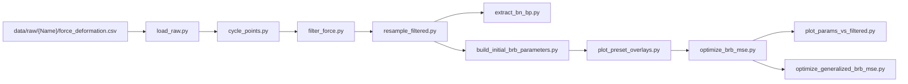

# Scripts layout (for reading and editing)

Run everything from the **repository root** unless a script docstring says otherwise. Orchestration: `run.ps1` / `run.sh` at the repo root.

## Folders

| Folder | Role |
|--------|------|
| `postprocess/` | Experimental CSV -> cycle JSON -> filtered -> resampled; QA plots. Imports are often **flat** (`import load_raw`) after `sys.path` inserts this directory--see each file's imports. |
| `calibrate/` | Apparent $b$, initial parameters, L-BFGS-B optimize, generalized eval (incl. digitized unordered F–u). Typically adds `scripts/` and `scripts/postprocess/` to `sys.path` to reach `specimen_catalog` and `model`. |
| `model/` | OpenSees corotruss + geometry (`corotruss.py`, `brace_geometry.py`). Imported as `from model.corotruss import ...` or `from calibrate.*` depending on caller. |

## Data flow (ordered / path specimens)

- **Single source of truth for "which names run"** in postprocess: `postprocess/specimen_catalog.py` (`list_names_for_standard_pipeline`, catalog flags).
- **Filtered/resampled** outputs are under `data/filtered/{Name}/` and `data/resampled/{Name}/` (`force_deformation.csv` and `deformation_history.csv` with `Step`); digitized **unordered** F–u samples are not smoothed; digitized **drive** is Savitzky-smoothed by segment unless `skip_filter_resample=true`, then same |Du| segment resampling as path-ordered. Legacy flat `data/filtered/{Name}.csv` is still read if present.

## Data flow (digitized unordered)

- Catalog: `experimental_layout=digitized` and `path_ordered=false`. Inputs: `data/raw/{Name}/deformation_history.csv` and `force_deformation.csv`.
- **Filter/resample** builds the deformation drive (cycle JSON in `filter_force.py`; unordered copy-only). Envelope $b_p$/$b_n$: `calibrate/digitized_unordered_bn.py`. Generalized eval (drive + `run_simulation`): `calibrate/digitized_unordered_eval_lib.py`.

## Common edits

| Goal | Where to change |
|------|-----------------|
| Add a specimen | `config/calibration/BRB-Specimens.csv` + place CSVs under `data/raw/{Name}/` (see root README) |
| Steel + apparent $b$ seeds per `set_id` | `config/calibration/set_id_settings.csv` (`E,R0,cR1,cR2,a1–a4,b_p,b_n`; `b_p`/`b_n` as number or median/mean/q1/q3/min/max); `--set-id-settings` on `build_initial_brb_parameters.py` (see root README) |
| L-BFGS box limits (`PARAMS_TO_OPTIMIZE`) | `config/calibration/params_limits.csv`; `--param-limits` on `optimize_brb_mse.py` / `optimize_generalized_brb_mse.py` (`calibrate/param_limits.py`) |
| Landmark + energy objective weights, amplitude $w_c$ | `config/calibration/set_id_settings.csv` (per `set_id` columns); `--amplitude-weights` / `--no-amplitude-weights` on optimize and eval scripts |
| No Savitzky on path-ordered filtered series (or digitized unordered drive) | `skip_filter_resample` in `BRB-Specimens.csv` (`filter_force.py`); resampling still runs |
| Optimize + generalized weights | `BRB-Specimens.csv` (`individual_optimize`, `generalized_weight`; `averaged_weight` is unused by scripts) -- see `calibrate/specimen_weights.py` |
| Objective (landmarks, energy, scales) | `calibrate/optimize_brb_mse.py`, `cycle_feature_loss.py`, `amplitude_mse_partition.py` |
| Preset combined overlays (two batches by default: train-only vs all specimens; `set*_combined_force_def_norm.png`) | `calibrate/plot_preset_overlays.py` |
| Steel model | `model/corotruss.py` |
| Metrics CSV column order | `calibrate/calibration_io.py` |
| Figure inches / font size (single vs grid plots) | `postprocess/plot_dimensions.py` (`SINGLE_FIGSIZE_IN`, `GRID_AX_*_IN`, `TWO_STACKED_FIG_W_IN`, `PLOT_FONT_SIZE_PT`, `configure_matplotlib_style`) |
| Markdown + CSV summary (per `steel_model`: `params_in_summary_tables_for_steel_model`) | `calibrate/report_calibration_param_tables.py` → `summary_statistics/calibration_parameter_summary.md` (index if both models) or `calibration_parameter_summary_<steel_model>.md` + CSVs; `optimize_generalized_brb_mse` / `report_generalized_set_id_eval_summary.py` → `generalized_set_id_eval_summary.csv` plus train/validation `generalized_unordered_J_binenv_summary_*.csv` |

## Import pattern

Many scripts predate a single package layout: they manipulate `sys.path` then import sibling modules by **short name** (`specimen_catalog`, `load_raw`). When adding a new script, **match the imports of the closest existing script** in the same folder so batch runs keep working.

## Docs elsewhere

- User-facing pipeline narrative: root `README.md`.
